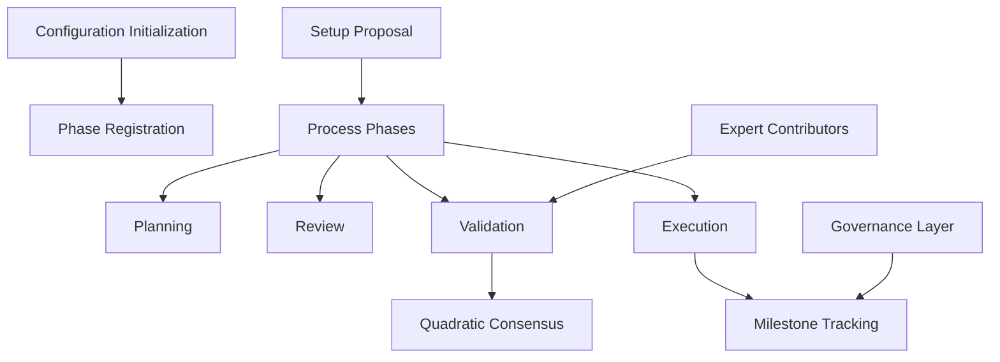

# Real-Time Setup Interpreter

A dynamic, decentralized configuration management system for complex, multi-phase processes with robust governance and execution tracking.

## Overview

Real-Time Setup Interpreter provides a flexible framework for managing intricate configuration and setup processes across various domains. The system enables:

- Dynamic phase-based configuration management
- Quadratic voting for collaborative decision-making
- Milestone-driven execution tracking
- Transparent and secure process governance
- Adaptable setup workflows with comprehensive validation

## Architecture

The Real-Time Setup Interpreter operates through a single smart contract that manages configuration phases, governance, execution tracking, and validation processes.



### Core Components

1. **Configuration Management**
   - Dynamic phase-based setup
   - Role-based access control
   - Contributor validation mechanism

2. **Process Lifecycle**
   - Four adaptive phases: Planning, Review, Validation, Execution
   - Milestone-driven progress tracking
   - Collaborative decision-making

3. **Governance Framework**
   - Transparent configuration tracking
   - Multi-stage validation
   - Comprehensive execution monitoring

## Contract Documentation

### setup-interpreter.clar

The core contract managing dynamic setup and configuration processes.

#### Key Functions

1. Member Management
```clarity
(define-public (register-member (token-amount uint) (is-expert bool)))
(define-public (delegate-votes (delegate principal)))
(define-public (remove-delegation))
```

2. Proposal Management
```clarity
(define-public (create-proposal (title (string-ascii 100)) 
                               (description (string-utf8 1000))
                               (link (string-ascii 255))
                               (funding-amount uint)
                               (milestones (list 10 {...}))))
```

3. Voting and Execution
```clarity
(define-public (vote-on-proposal (proposal-id uint) (vote-for bool)))
(define-public (execute-proposal (proposal-id uint)))
(define-public (complete-milestone (proposal-id uint) (milestone-index uint)))
```

## Getting Started

### Prerequisites

- Clarinet
- Stacks wallet
- LOOM tokens for membership

### Basic Usage

1. Register as a member:
```clarity
(contract-call? .loom-dao register-member u1000 false)
```

2. Create a proposal:
```clarity
(contract-call? .loom-dao create-proposal "Sustainable Cotton Alternative" 
                "Development of bamboo-based fabric" 
                "https://example.com/proposal" 
                u10000 
                milestones)
```

3. Vote on a proposal:
```clarity
(contract-call? .loom-dao vote-on-proposal u1 true)
```

## Function Reference

### Contributor Management Functions

| Function | Description | Parameters |
|----------|-------------|------------|
| register-contributor | Join the configuration system | role-level: uint, is-expert: bool |
| delegate-configuration-rights | Delegate configuration permissions | delegate: principal |
| remove-delegation | Revoke configuration delegation | None |

### Setup Proposal Functions

| Function | Description | Parameters |
|----------|-------------|------------|
| create-setup-proposal | Propose a new configuration | title: string, description: string, complexity-score: uint, milestones: list |
| vote-on-configuration | Cast validation vote | proposal-id: uint, vote-for: bool |
| advance-setup-phase | Progress configuration lifecycle | proposal-id: uint |

## Development

### Testing

1. Clone the repository
2. Install Clarinet
3. Run tests:
```bash
clarinet test
```

### Local Development

1. Start Clarinet console:
```bash
clarinet console
```

2. Deploy contract:
```bash
clarinet deploy
```

## Security Considerations

### Access Control
- Only members can create proposals and vote
- Milestone funding requires proper phase progression
- Expert status changes restricted (admin function)

### Treasury Security
- Milestone-based fund release
- Balance checks before disbursement
- Proposal state validation

### Voting Protection
- One vote per proposal per member
- Quadratic voting to prevent token concentration
- Mandatory phase progression

### Known Limitations
- Simplified quadratic voting calculation
- Basic treasury management
- Limited proposal parameter validation